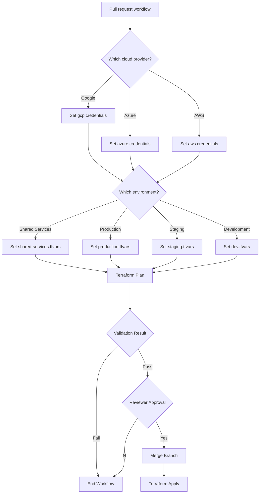

# Terraform Workflow Example

Directories are structured by cloud providers and environments:

Directory structure example:
```
|-- terraform-stacks
    |-- cloud-provider
    |   |-- shared-services
    |   |   |-- modules
    |   |   |-- files.tf
    |   |   |-- shared-services.tfvars
    |   |-- production
    |   |   |-- modules
    |   |   |-- files.tf
    |   |   |-- production.tfvars   
    |   |-- staging
    |   |   |-- modules
    |   |   |-- files.tf
    |   |   |-- staging.tfvars
    |   |-- development
    |   |   |-- modules
    |   |   |-- files.tf
    |   |   |-- development.tfvars
```

Terraform Workflow:


