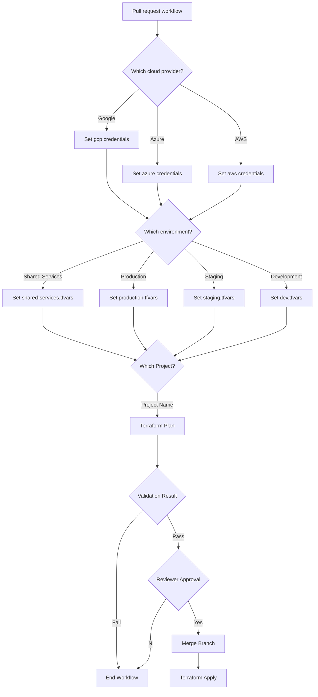

# gcp-terraform-example
Testing github actions with terraform
    
```
|-- terraform-stacks
    |-- aws
    |   |-- project
    |   |   |-- modules
    |   |   |-- files.tf    
    |-- azure
    |   |-- project
    |   |   |-- modules
    |   |   |-- files.tf    
    |-- google
    |   |-- project
    |   |   |-- modules
    |   |   |-- files.tf    
```


